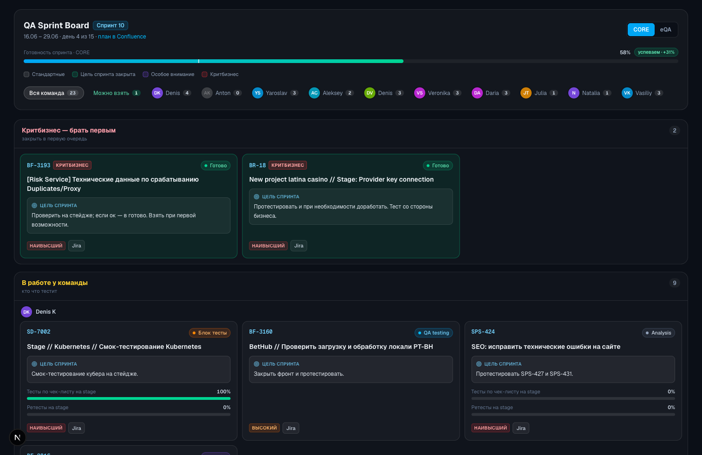
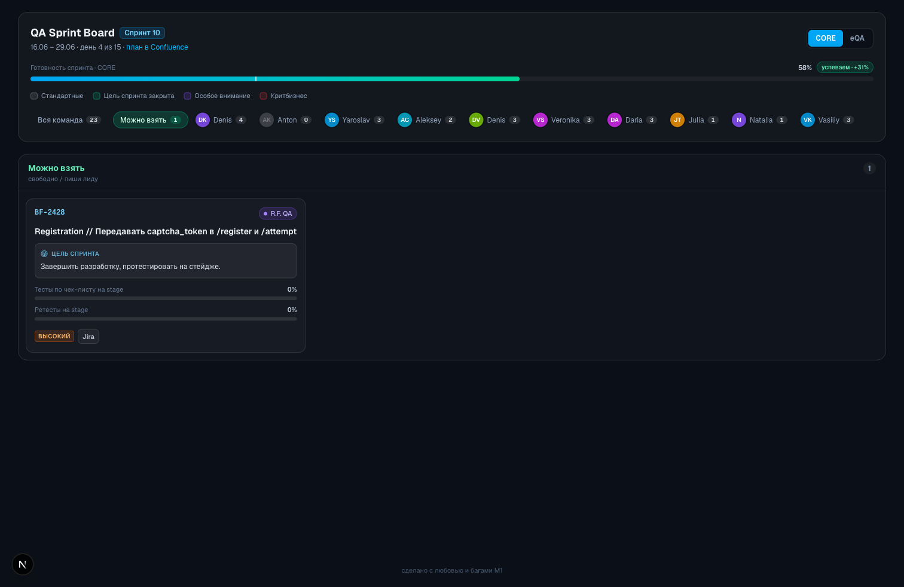
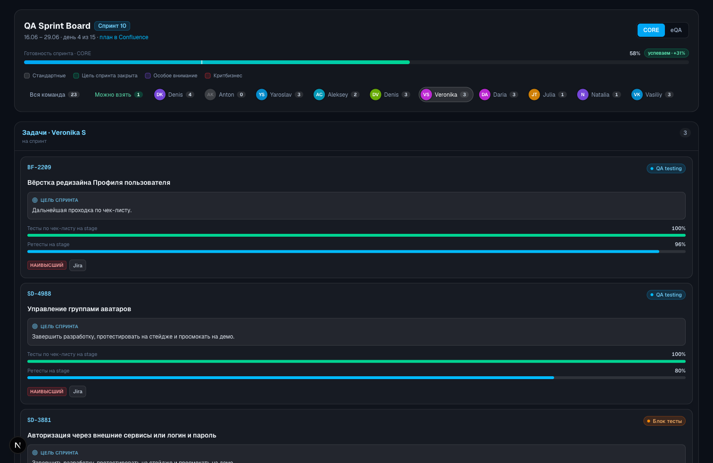
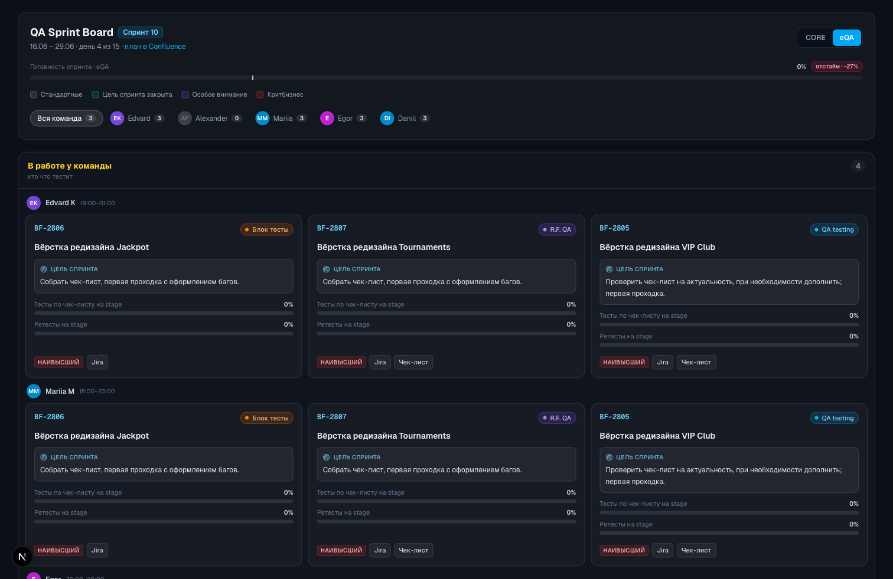
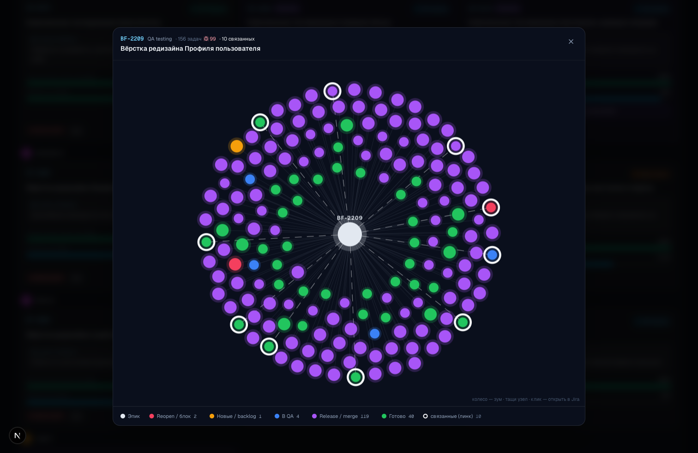
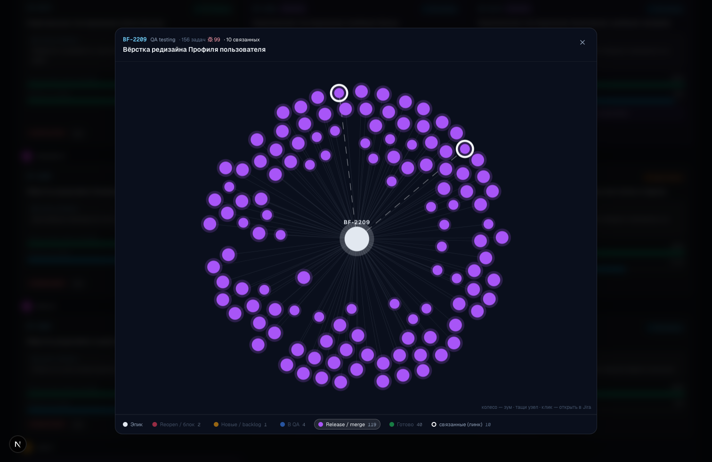

<div align="center">

# 🎯 QA Sprint Board

**Живая витрина спринта для QA-команды SprutGaming.**
Зашёл — и сразу видно: что у тебя на спринт, кто над чем работает, что можно взять и как идёт прогресс по эпикам. Статусы и ретесты подтягиваются из Jira автоматически.

[](https://nextjs.org/)
[](https://react.dev/)
[](https://www.typescriptlang.org/)
[](https://tailwindcss.com/)
[](https://neon.tech/)

</div>



---

## 📖 О проекте

**QA Sprint Board** — лёгкая доска спринта, заточенная под повседневную работу линейного тестировщика. Открыл и за пару секунд понял картину дня.

Архитектура — **BFF** (Backend For Frontend) на Next.js: фронт + API-роуты + Postgres. Два источника данных, каждый отвечает за своё:

- **Jira** — операционка: статусы, исполнители, приоритеты, процент ретестов, тип (эпик/задача). Подтягивается автоматически по крону.
- **Своя БД** — QA-специфика, которой нет в Jira: проценты прохождения чек-листов (`firstPass`), флаги, цели, состав команды и распределение. Редактируется лидом через **мини-админку**, без правки кода и редеплоя.

> Если БД/Jira недоступны, доска падает на статический снапшот [`src/data/sprint.ts`](src/data/sprint.ts) — не белый экран, а последнее известное состояние.

---

## ✨ Возможности

- **Две команды** — переключатель **CORE / eQA** (у внешней команды видны часы смен).
- **Режимы просмотра** — «Вся команда», «Можно взять» и фокус на конкретном тестере, со счётчиками карточек.
- **Критбизнес наверху** — задачи, которые брать первыми, закреплены отдельной полосой.
- **Двойная шкала прогресса** — «Тесты по чек-листу на stage» (`firstPass`, вводит лид) и «Ретесты на stage» (`retest`, считается из Jira).
- **Готовность спринта** — автоматический расчёт по эпикам команды + темп («успеваем / впритык / отстаём») относительно прошедшего времени.
- **Авто-синк с Jira** — статусы, исполнители, ретесты и тип тикета обновляются по расписанию; эпик/задача определяется по `issuetype` (у задач шкалы скрыты).
- **Живой граф связей эпика** — клик по карточке открывает force-directed граф дочерних и связанных задач (данные из Jira), с цветовой картой статусов, счётчиками и фильтром по цвету.
- **Мини-админка** (`/admin`) — спринты, эпики (проценты, флаги, цель), назначения и состав команды. Под токеном.
- **Статусы 1:1 с Jira** — бейджи повторяют реальный воркфлоу (`Analysis`, `Блок тесты`, `R.F. QA`, `QA testing`, `R.F Release`, `Готово` …).
- **Адаптив и safe-area** — корректно живёт на мобайле (от 360px) и устройствах с вырезом.

---

## 🖼️ Скриншоты

### Зона «Можно взять» и двойная шкала прогресса


### Фокус на тестере


### Команда eQA


### Граф связей эпика
Клик по карточке → живой граф из Jira. В центре эпик, вокруг — дочерние (`parent`) и связанные (issue links) задачи. Цвет узла = смысл статуса, баги крупнее, связанные — с белой обводкой.



### Фильтр графа по цвету


---

## 🚀 Быстрый старт

```bash
npm install
cp .env.local.example .env.local   # заполнить значения (см. ниже)

# применить миграции по очереди (раннер берёт один файл за запуск)
npm run migrate migrations/001_initial.sql
npm run migrate migrations/002_issue_type.sql
npm run migrate migrations/003_epic_graph.sql

npm run seed                        # засеять активный спринт из sprint.ts
npm run dev                         # http://localhost:3000
```

Переменные окружения (`.env.local`):

| Переменная | Зачем |
|---|---|
| `DATABASE_URL` | пул-коннект к Postgres (рантайм) |
| `DATABASE_URL_UNPOOLED` | прямой коннект (миграции/скрипты) |
| `JIRA_BASE_URL` | адрес Jira (`https://<org>.atlassian.net`) |
| `JIRA_TOKEN` | `base64("email:api_token")` для Jira API |
| `ADMIN_TOKEN` | вход в админку `/admin` |
| `CRON_SECRET` | защита эндпоинта синка `/api/cron/sync` |

Полезные команды:

```bash
npm run build      # прод-сборка
npm run start      # запуск прод-сборки
npm run lint       # ESLint
npm run test       # Vitest (юнит + интеграционные)
npx tsc --noEmit   # проверка типов
```

---

## 🗂️ Архитектура

```text
src/
├─ app/
│  ├─ page.tsx                # витрина: зоны, режимы, шкала готовности
│  ├─ admin/                  # мини-админка (под токеном)
│  │  ├─ page.tsx             #   дашборд + виджет размера БД
│  │  ├─ sprints/  epics/  assignments/  login/
│  └─ api/                    # BFF: REST-роуты
│     ├─ sprint/active        #   агрегат для доски (эпики+мета+прогресс)
│     ├─ sprint, sprint/[id]  #   CRUD спринтов
│     ├─ epics, epics/[id]    #   QA-данные эпиков (firstPass, флаги, цель)
│     ├─ assignments[…]       #   назначения
│     ├─ members[…]           #   состав команды
│     ├─ graph/[key]          #   живой граф эпика из jira_cache
│     ├─ cron/sync, jira/sync #   синк с Jira (по крону / вручную)
│     └─ admin/login, admin/db-stats
├─ lib/
│  ├─ db.ts          # клиент Postgres (sql-шаблоны)
│  ├─ jira.ts        # клиент Jira: мета, retest %, граф, issuetype
│  ├─ sync.ts        # синк активного спринта → jira_cache
│  ├─ auth.ts        # токен-авторизация админки (fail-closed)
│  ├─ http.ts        # парсинг тел, единые ответы 400/404/500
│  └─ format.ts      # статусы/приоритеты, прогресс спринта, аватары
├─ components/
│  ├─ BoardDataProvider.tsx   # тянет /api/sprint/active, fallback на sprint.ts
│  ├─ EpicCard.tsx            # карточка эпика (двойная шкала, граф по клику)
│  ├─ EpicGraphModal.tsx      # force-directed граф + фильтр по цвету
│  ├─ Avatar.tsx, Badges.tsx
├─ data/
│  ├─ sprint.ts      # СТАТИЧЕСКИЙ fallback (если API недоступен)
│  └─ epicGraph.ts   # типы + цветовая карта тонов графа (+ fallback json)
└─ proxy.ts          # middleware: защита /admin/*

migrations/          # 001 схема · 002 issue_type · 003 epic_graph
scripts/
├─ migrate.ts        # раннер миграций
└─ seed.ts           # сид активного спринта из sprint.ts
```

### Модель данных (Postgres)

| Таблица | Что хранит |
|---|---|
| `sprints` | номер, даты, ссылка на Confluence, флаг активности |
| `sprint_epics` | состав спринта + QA-специфика: цель, приоритет, флаги (`critbusiness`, `goal_done`, `task`) |
| `progress_entries` | проценты прохождения чек-листов (`first_pass`), вводит лид |
| `assignments` | кто над чем работает: `{ member_id, jira_key, note }` |
| `members` | состав команд, отпуска (`on_vacation`), смены eQA (`shift`) |
| `jira_cache` | кэш из Jira: статус, исполнитель, приоритет, retest %, `issue_type`, снапшот графа |

**Логика зон:** эпик команды, не встречающийся ни в одном `assignment`, автоматически попадает в **«Можно взять»**. Критбизнес закрепляется сверху.

---

## 🔄 Как обновляются данные

- **Из Jira (автоматически).** Планировщик (GitHub Actions, `.github/workflows/jira-sync.yml`, каждые 30 мин) дёргает `/api/cron/sync` → для каждого эпика активного спринта обновляются статус, исполнитель, приоритет, процент ретестов `(Done + R.F Release) / (дочерние + связанные)`, тип тикета и снапшот графа. То же самое умеет кнопка «Синк Jira» в админке (`/api/jira/sync`) — для ручного форса «прямо сейчас».
- **Через админку (руками лида).** На `/admin` лид правит то, чего нет в Jira: проценты чек-листов (`firstPass`), цели спринта, флаги, состав команды и распределение. Изменения сразу видны на доске, без редеплоя.

> Контекст для ассистента — в [`AGENTS.md`](AGENTS.md), журнал правок — в [`CHANGELOG.md`](CHANGELOG.md).

---

## 🧱 Стек

**Next.js 16** (App Router) · **React 19** · **TypeScript 5** · **Tailwind CSS v4** · **PostgreSQL** (Neon, драйвер `@neondatabase/serverless`) · **lucide-react** · **react-force-graph-2d** · **Vitest**.

---

## 📦 Деплой

Текущий деплой — **Vercel**, автоподтягивание из ветки `main`. Регулярный синк с Jira — **GitHub Actions** по расписанию (`.github/workflows/jira-sync.yml`), пингует `/api/cron/sync`. Для него нужны два секрета репозитория: `SYNC_URL` (полный URL эндпоинта) и `CRON_SECRET`.

Перед первым запуском на новом окружении:

1. Завести переменные окружения (см. таблицу выше).
2. Применить миграции `001 → 003` к боевой БД (см. «Быстрый старт»).
3. Засеять активный спринт (`npm run seed`) — один раз.

> Приложение — ванильный Next.js без Vercel-only фич, поэтому переносимо на любой Node-рантайм (VM / Docker / k8s) с обычным Postgres.

---

<div align="center">
  <sub>Сделано для QA-команды SprutGaming · витрина спринта, а не замена Jira.</sub>
</div>
